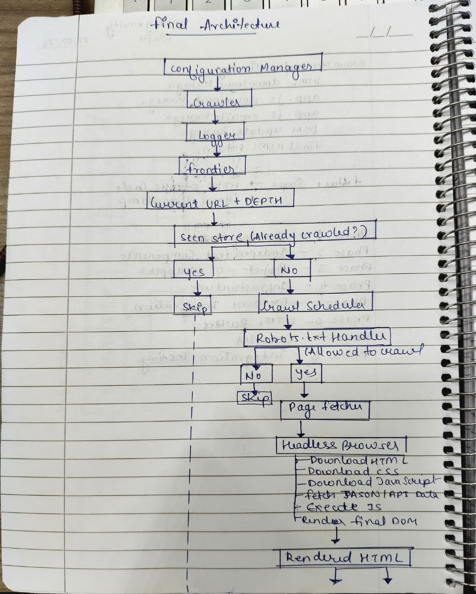
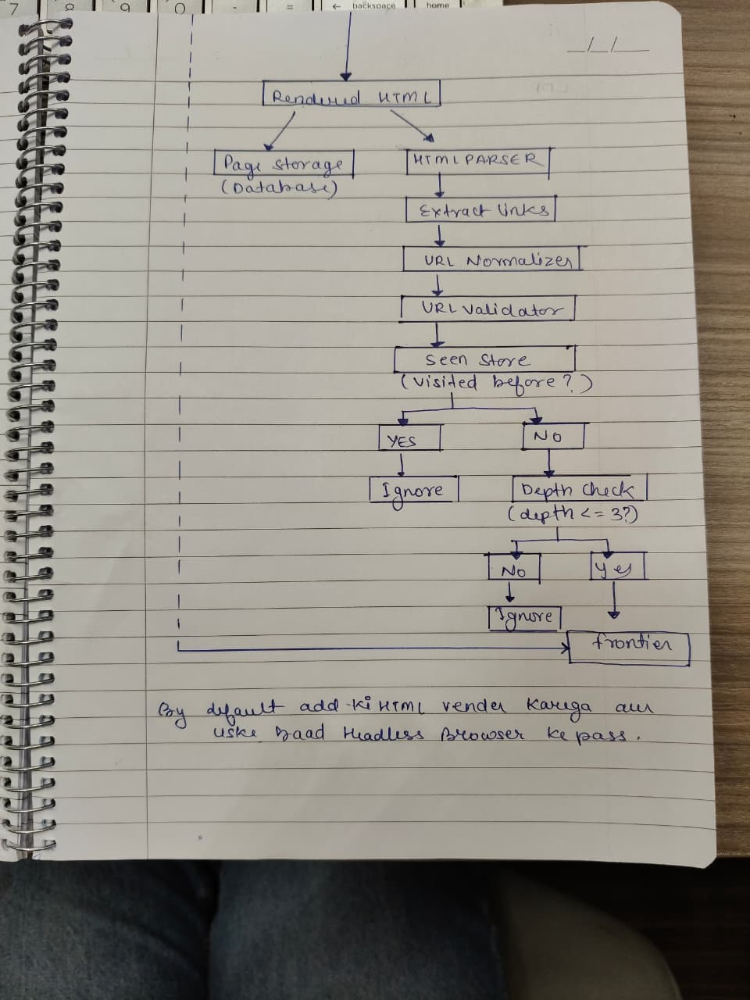

# Section 1 – Public API

## Config

```cpp
class Config {
public:
    void load(string configFilePath);
    int getMaxDepth();
    int getTimeoutSeconds();
    string getDatabasePath();
};
```
This class reads the crawler settings from a configuration file. Other classes get values like maximum depth and timeout from this class instead of using fixed numbers.


## Logger

```cpp
class Logger {
public:
    void log(string event, string url, string detail = "");
};
```
This class records important events while the crawler is running. Every component uses the same logger so that all messages appear in one place.

## RobotsHandler

```cpp
class RobotsHandler {
public:
    bool isAllowed(string url);
};
```
This class checks the website's `robots.txt` file to see whether a URL is allowed to be crawled. If crawling is not allowed, the URL is skipped.

## CrawlScheduler

```cpp
class CrawlScheduler {
public:
    void waitBeforeNextRequest();
};
```

This class adds a small delay between requests so the crawler does not send too many requests to a website.

## Frontier (Uses Project-01 LinkedList)

```cpp
void push(URLDepth item);
URLDepth pop();
bool empty();
int size();
```

The Frontier stores URLs that still need to be crawled.

## SeenStore (Uses Project-01 HashMap)

```cpp
bool contains(string url);
void markVisited(string url);
int count();
void clear();
```

This class keeps track of URLs that have already been visited so the crawler does not visit the same page again.

## PageFetcher

```cpp
string fetchPage(string url);
```
Downloads a webpage and returns its HTML. If the page cannot be downloaded, it returns an empty string.

## HTMLParser

```cpp
DynamicArray<string> extractLinks(string html);
```
Reads HTML and extracts all links from the page.

## URLNormalizer

```cpp
string normalize(string url, string baseURL);
```

Converts different forms of the same URL into one standard format.

## URLValidator

```cpp
bool isValid(string url);
```
Checks whether a URL is valid before the crawler uses it.

## PageStorage

```cpp
void storePage(string url, string html, int depth);
string getPage(string url);
bool hasPage(string url);
string getURLByID(int id);
int pageCount();
```
Stores the downloaded HTML pages and allows them to be retrieved later.

## Crawler

```cpp
Crawler(Config config);
void crawl(string seedURL);
```

This is the main class. It controls the complete crawling process using all the other components.

## Why I separated the classes

Each class has only one responsibility.

- Config manages settings.
- Logger records events.
- RobotsHandler checks crawling permissions.
- CrawlScheduler controls request timing.
- HTMLParser extracts links.
- URLNormalizer standardizes URLs.
- URLValidator checks URLs.
- PageStorage saves pages.

Keeping these jobs separate makes the code easier to understand, maintain, and reuse in future projects.


# Section 2 – Internal Representation




# Section 3 – Failure Handling

* **Invalid URL:** Skip the URL and record a log message.
* **Blocked by robots.txt:** Skip the URL without downloading it.
* **Duplicate URL:** Ignore it because it has already been visited.
* **Download failure:** Skip the page and continue crawling.
* **Broken HTML:** Extract whatever links are available without crashing.
* **Empty page:** Do not store it.
* **Missing or invalid config file:** Use default values such as `maxDepth = 3` and continue running.

---

# Section 4 – Complexity Analysis

| Operation                 | Complexity                       |
| ------------------------- | -------------------------------- |
| SeenStore.contains()      | Average O(1), Worst O(N)         |
| SeenStore.markVisited()   | Average O(1), Worst O(N)         |
| Frontier.push()           | O(1)                             |
| Frontier.pop()            | O(1)                             |
| PageStorage.storePage()   | Average O(1), Worst O(log N)     |
| PageStorage.getPage()     | Average O(1), Worst O(log N)     |
| HTMLParser.extractLinks() | O(H), where H is the HTML length |
| RobotsHandler.isAllowed() | O(1) average, O(R) worst         |

The HashMap makes duplicate checking very fast, and the KMP algorithm allows the HTML parser to scan the page efficiently.

---

# Section 5 – Future Compatibility

Project-03 will reuse the pages stored by this crawler.

```cpp
for (int id = 1; id <= storage.pageCount(); id++) {
    string url = storage.getURLByID(id);
    string html = storage.getPage(url);
}
```

Project-03 can read every stored page using its ID. Since the original HTML is stored, it can extract text and build the search index without downloading the pages again.
